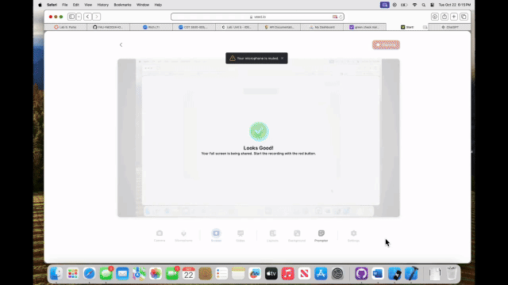

# Lab 5 - *Parks*

Submitted by: **Noah Russell** **Z23667779**

**Parks** is an app that will allow users to explore national parks , conveniently filtered by state. By selecting a park, users can navigate to a detail screen offering more comprehensive information about the park, additional images, and a map showcasing the park's location. Although the SwiftUI implementation details may be new, your past experience in building REST clients with UIKit will give you an advantage, as the app's high-level structure and design remain similar. So lace up your hiking boots and get ready to hit the trail! 

Time spent: **3** hours spent in total

## Required Features

The following **required** functionality is completed:

- [✅] View a list parks fetched from the national parks API
- [✅] Tap a park to view a detail screen with more info, images and a map of the park's location

 
The following **optional** features are implemented:

- [❌] Select a state from a menu to view all parks in the selected state
- [❌] Sort parks alphabetically ascending/descending
- [❌] Search for a park via a search bar

The following **additional** features are implemented:

- [ ] List anything else that you can get done to improve the app functionality!

## Video Walkthrough

My video Walkthrough:

GIF created with VEED.io

## Notes

As an avid hiker/National Park enjoyer, I will definitely be using + adding to this app.

## License

    Copyright [2024] [Noah Russell]

    Licensed under the Apache License, Version 2.0 (the "License");
    you may not use this file except in compliance with the License.
    You may obtain a copy of the License at

        http://www.apache.org/licenses/LICENSE-2.0

    Unless required by applicable law or agreed to in writing, software
    distributed under the License is distributed on an "AS IS" BASIS,
    WITHOUT WARRANTIES OR CONDITIONS OF ANY KIND, either express or implied.
    See the License for the specific language governing permissions and
    limitations under the License.
